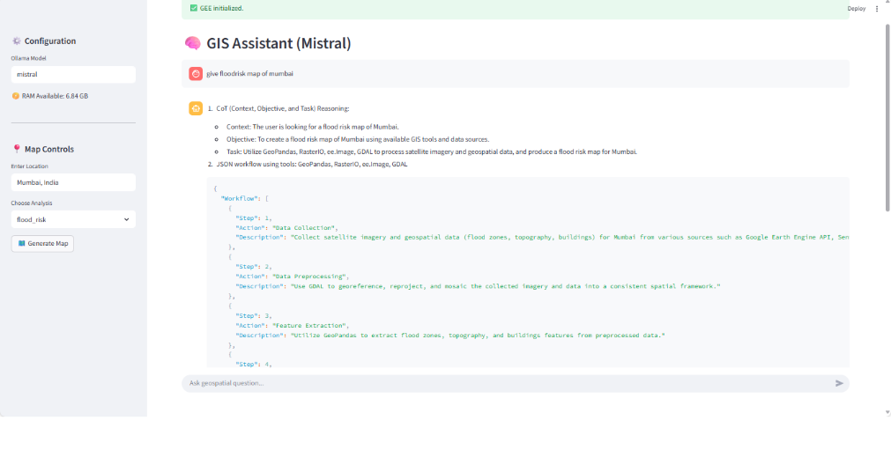
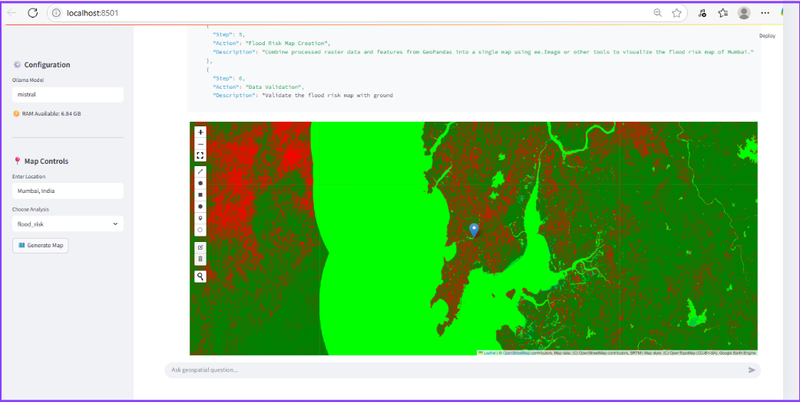
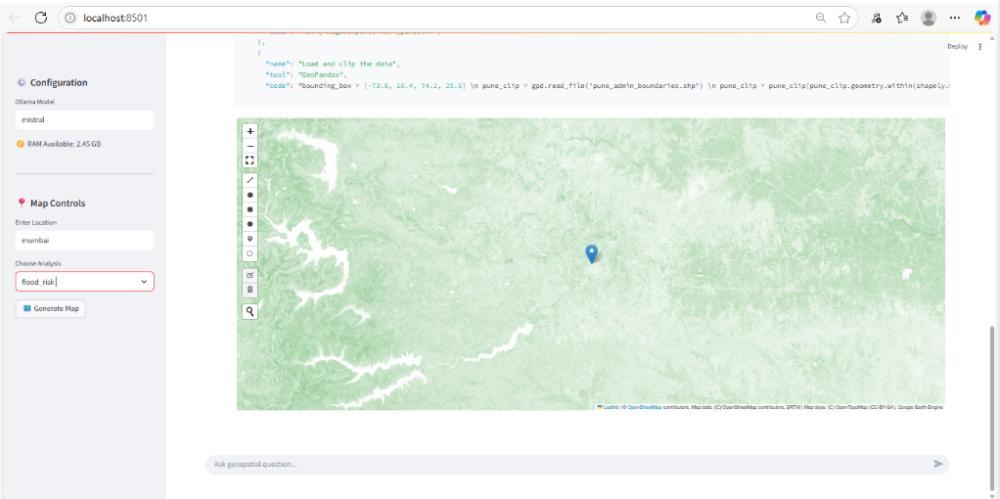
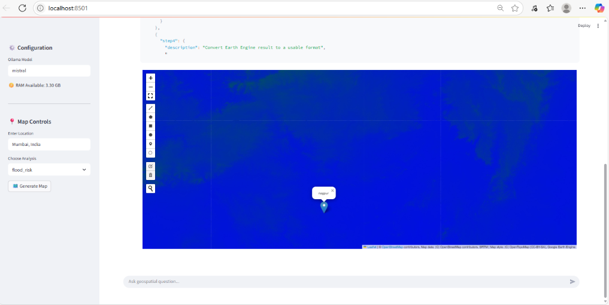
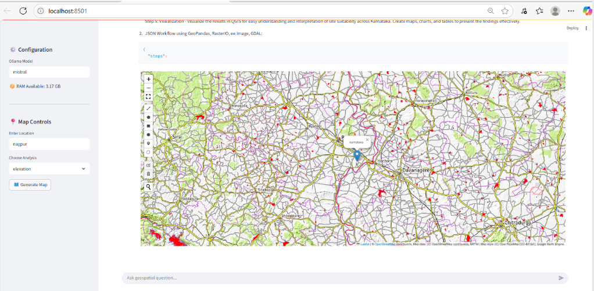

# 🗺️ VicharShakti-M: AI-Powered GIS Assistant

<div align="center">


**Transform Natural Language into Powerful Geospatial Insights**

[Features](#-features) • [Demo](#-demo) • [Installation](#-installation) • [Usage](#-usage) • [Tech Stack](#️-tech-stack)

</div>

---

## 🌟 Overview

**VicharShakti-M** is an intelligent GIS assistant that revolutionizes geospatial analysis by converting natural language queries into comprehensive flood risk maps and spatial visualizations. Powered by Mistral AI and integrated with advanced GIS tools, it makes complex geospatial analysis accessible to everyone—no GIS expertise required.

Simply ask questions like *"Show me flood risk areas in Mumbai"* and watch as the AI automatically collects data, processes satellite imagery, analyzes terrain, and generates interactive maps with actionable insights.

---

## 📸 Screenshots

### AI-Powered Workflow Generation
The assistant understands your query and automatically breaks it down into actionable steps:



*The AI assistant analyzing context and creating a multi-step geospatial workflow*

---

### Interactive Map Visualizations

<div align="center">

#### 🌊 Flood Risk Analysis Map


*High-resolution flood risk assessment showing vulnerable zones in red and safe areas in green*

---

#### 🗻 Elevation & Terrain Analysis


*Detailed elevation mapping with topographical features and terrain analysis*

---

#### 🌍 Comprehensive Earth Engine Results


*Satellite imagery processed through Google Earth Engine API*

---

#### 🌱 Land Cover & Vegetation Analysis


*Advanced land cover classification showing vegetation, water bodies, and urban areas*

---

#### 🏘️ Infrastructure & Urban Mapping


*Detailed infrastructure mapping with roads, buildings, and administrative boundaries*

</div>

---

## ✨ Features

### 🤖 Natural Language Processing
- **Conversational Interface**: Ask questions in plain English
- **Context Understanding**: AI comprehends complex geospatial queries
- **Multi-step Reasoning**: Breaks down complex analysis into logical workflows
- **Intelligent Agent System**: Autonomous decision-making for data collection and processing

### 🗺️ Advanced Geospatial Analysis
- **Flood Risk Mapping**: Automated flood zone identification and risk assessment
- **Satellite Imagery Processing**: Real-time collection and analysis of satellite data
- **Terrain Analysis**: Elevation, slope, and topographical feature extraction
- **Multi-layer Visualization**: Combine various data sources for comprehensive insights
- **Land Cover Classification**: Vegetation, water bodies, and urban area detection

### 🛰️ Data Integration
- **Google Earth Engine API**: Access to vast satellite imagery archives
- **GeoPandas Integration**: Seamless vector data processing
- **RasterIO Processing**: Advanced raster data manipulation
- **GDAL Support**: Industry-standard geospatial data formats
- **Real-time Data Collection**: Dynamic data gathering from multiple sources

### 📊 Interactive Visualizations
- **Dynamic Maps**: Zoom, pan, and explore generated visualizations
- **Color-coded Risk Zones**: Intuitive heat maps for quick understanding
- **Overlay Capabilities**: Compare multiple analysis layers
- **Export Options**: Save maps and data for further use
- **High-Resolution Output**: Professional-grade map generation

---

## 🎯 Demo

### Query Flow Example
```
User: "Give me a flood risk map of Mumbai"

AI Assistant (Mistral):
✓ Step 1: Context, Objective, and Task Reasoning
  → Context: User is looking for a flood risk map of Mumbai
  → Objective: Create a flood risk map using available GIS tools
  → Task: Utilize GeoPandas, RasterIO, ee.Image, GDAL to process satellite imagery

✓ Step 2: Data Collection
  → Gathering satellite imagery and geospatial data from Google Earth Engine
  → Collecting topography, flood zones, buildings data

✓ Step 3: Data Preprocessing
  → Georeferencing and mosaicking satellite imagery
  → Using GDAL to georeference and align imagery

✓ Step 4: Feature Extraction
  → Utilizing GeoPandas to extract flood zones, topography, and buildings
  → Processing spatial data into consistent framework

✓ Step 5: Flood Risk Map Creation
  → Combining processed raster data and features
  → Using Image or GeoTIFF tools to visualize results

✓ Step 6: Data Validation
  → Validating the results in QGIS for accuracy

✓ Status: ✅ GEE initialized. Map generation successful!
```

### Analysis Capabilities
- **Flood Risk Assessment**: Multi-zone risk analysis with severity classification
- **Elevation Mapping**: 3D terrain visualization with contour lines
- **Land Use Classification**: Urban, agricultural, and natural area detection
- **Infrastructure Analysis**: Critical infrastructure vulnerability assessment
- **Vegetation Health**: NDVI analysis and vegetation monitoring
- **Water Body Detection**: Rivers, lakes, and flood-prone areas

---

## 🚀 Installation

### Prerequisites
```bash
- Python 3.8+
- GDAL library
- Node.js 14+ (for frontend)
- Google Earth Engine account
- Mistral API key
```

### Clone Repository
```bash
git clone https://github.com/nikhilbhoir0808/vicharshaktim.git
cd vicharshaktim
```

### Backend Setup
```bash
cd backend
pip install -r requirements.txt

# Set up environment variables
cp .env.example .env
# Add your API keys:
# - MISTRAL_API_KEY=your_mistral_api_key
# - GOOGLE_EARTH_ENGINE_KEY=your_gee_credentials
```

### Frontend Setup
```bash
cd frontend
npm install
```

### Initialize GEE Authentication
```bash
python -c "import ee; ee.Authenticate(); ee.Initialize()"
```

---

## 💻 Usage

### Start Backend Server
```bash
cd backend
python app.py
# Server will start on http://localhost:8501
```

### Start Frontend
```bash
cd frontend
npm start
# Application will open on http://localhost:3000
```

### Access Application
Open your browser and navigate to:
```
http://localhost:8501
```

### Example Queries

#### Simple Queries
```
🔹 "Show me flood risk areas in Mumbai"
🔹 "Generate an elevation map for this location"
🔹 "What's the vegetation coverage in this area?"
```

#### Advanced Queries
```
🔹 "Analyze flood vulnerability in coastal regions of Mumbai and identify high-risk zones"
🔹 "Create a multi-layer risk assessment map combining elevation, land cover, and urban density"
🔹 "Compare vegetation health between two time periods"
🔹 "Map infrastructure in flood-prone areas and assess vulnerability"
```

### Configuration Options

**Ollama Model Selection**:
- Choose from available models: `mistral`, `llama2`, or custom models
- Configure RAM allocation for optimal performance

**Map Controls**:
- **Enter Location**: Specify city, region, or coordinates
- **Choose Analysis**: Select from flood_risk, elevation, landcover, etc.
- **Generate Map**: Click to process and visualize

---

## 🛠️ Tech Stack

### AI & LLM
- **Mistral AI**: Advanced language understanding and multi-step reasoning
- **LangChain**: AI workflow orchestration and agent management
- **Custom Agents**: Specialized geospatial analysis agents
- **CoT Reasoning**: Chain-of-Thought for complex problem decomposition

### Geospatial Libraries
- **Google Earth Engine**: Petabyte-scale satellite imagery and geospatial datasets
- **GeoPandas**: Vector data processing and spatial operations
- **RasterIO**: High-performance raster data I/O
- **GDAL**: Geospatial data abstraction and format conversion
- **Folium/Leaflet**: Interactive web-based map visualization
- **Shapely**: Geometric operations and spatial analysis

### Backend
- **Python 3.8+**: Core application logic
- **Flask/FastAPI**: RESTful API services
- **NumPy**: Numerical computing
- **Pandas**: Data manipulation and analysis
- **Pillow**: Image processing and manipulation
- **JSON Workflows**: Structured multi-step processing

### Frontend
- **React.js**: Modern component-based UI
- **Leaflet.js**: Interactive map rendering and controls
- **Axios**: HTTP client for API communication
- **Material-UI**: Beautiful, responsive design components

### DevOps & Tools
- **Docker**: Containerization (optional)
- **Git**: Version control
- **QGIS**: Validation and advanced analysis

---

## 📁 Project Structure
```
vicharshaktim/
├── backend/
│   ├── app.py                 # Flask application entry point
│   ├── gis_agent.py          # Mistral AI agent for GIS operations
│   ├── gee_utils.py          # Google Earth Engine utilities
│   ├── processing/           # Data processing modules
│   │   ├── raster.py         # Raster data processing
│   │   ├── vector.py         # Vector data processing
│   │   └── analysis.py       # Spatial analysis functions
│   ├── models/               # AI model configurations
│   ├── config.py             # Configuration management
│   └── requirements.txt
├── frontend/
│   ├── src/
│   │   ├── components/       # React components
│   │   │   ├── MapViewer.js
│   │   │   ├── QueryInput.js
│   │   │   └── Configuration.js
│   │   ├── services/         # API services
│   │   ├── utils/            # Helper functions
│   │   └── App.js
│   ├── public/
│   └── package.json
├── data/                      # Temporary data storage
│   ├── raw/                  # Raw downloaded data
│   ├── processed/            # Processed datasets
│   └── cache/                # Cached results
├── outputs/                   # Generated maps and reports
│   ├── maps/
│   └── reports/
├── screenshots/              # Application screenshots
├── docs/                     # Documentation
├── tests/                    # Unit and integration tests
├── .env.example             # Environment variables template
├── .gitignore
├── LICENSE
└── README.md
```

---

## 🎯 Use Cases

### 🌊 Disaster Management
- **Emergency Response**: Real-time flood risk assessment during disasters
- **Risk Zone Identification**: Proactive identification of vulnerable areas
- **Evacuation Planning**: Optimal route planning based on terrain and risk
- **Infrastructure Protection**: Critical asset vulnerability mapping

### 🏗️ Urban Planning
- **Development Site Evaluation**: Assess flood risk before construction
- **Zoning Compliance**: Ensure regulations meet safety standards
- **Infrastructure Vulnerability**: Identify at-risk utilities and buildings
- **Smart City Planning**: Data-driven urban development decisions

### 🌍 Environmental Monitoring
- **Climate Change Impact**: Track environmental changes over time
- **Watershed Management**: River basin and drainage analysis
- **Ecological Risk Assessment**: Habitat vulnerability studies
- **Deforestation Tracking**: Vegetation cover change detection

### 📊 Research & Academia
- **Geospatial Analysis**: Advanced spatial data science research
- **Climate Studies**: Long-term environmental trend analysis
- **Geographic Research**: Spatial pattern investigation
- **Educational Tool**: Teaching GIS and remote sensing concepts

### 🏛️ Government & Policy
- **Urban Policy Making**: Evidence-based policy decisions
- **Resource Allocation**: Target disaster preparedness resources
- **Public Safety**: Community risk communication
- **Compliance Monitoring**: Regulatory enforcement support

---

## 🔧 Configuration

### Environment Variables

Create a `.env` file in the backend directory:
```env
# API Keys
MISTRAL_API_KEY=your_mistral_api_key_here
GOOGLE_EARTH_ENGINE_CREDENTIALS=path/to/gee_credentials.json

# Server Configuration
FLASK_APP=app.py
FLASK_ENV=development
PORT=8501

# Data Storage
DATA_DIR=./data
OUTPUT_DIR=./outputs
CACHE_DIR=./data/cache

# Model Configuration
DEFAULT_MODEL=mistral
RAM_ALLOCATION=6.84GB

# Map Settings
DEFAULT_LOCATION=Mumbai, India
DEFAULT_ZOOM=10
```

### Model Configuration

Modify `config.py` to customize model behavior:
```python
ANALYSIS_TYPES = {
    'flood_risk': 'Flood risk assessment and vulnerability mapping',
    'elevation': 'Elevation and terrain analysis',
    'landcover': 'Land cover classification',
    'infrastructure': 'Infrastructure and urban mapping',
    'vegetation': 'Vegetation health and NDVI analysis'
}

MAP_STYLES = {
    'default': 'OpenStreetMap',
    'satellite': 'Google Satellite',
    'terrain': 'Mapbox Terrain'
}
```

---

## 🤝 Contributing

We welcome contributions! Here's how you can help:

### Ways to Contribute
- 🐛 Report bugs and issues
- 💡 Suggest new features or analysis types
- 📝 Improve documentation
- 🔧 Submit pull requests
- ⭐ Star the repository

### Contribution Process

1. **Fork the repository**
```bash
git clone https://github.com/YOUR_USERNAME/vicharshaktim.git
```

2. **Create a feature branch**
```bash
git checkout -b feature/AmazingFeature
```

3. **Make your changes**
- Follow existing code style
- Add tests for new features
- Update documentation

4. **Commit your changes**
```bash
git commit -m 'Add some AmazingFeature'
```

5. **Push to the branch**
```bash
git push origin feature/AmazingFeature
```

6. **Open a Pull Request**
- Describe your changes clearly
- Reference any related issues
- Wait for review and feedback

### Development Guidelines
- Write clean, documented code
- Follow PEP 8 for Python code
- Use ESLint for JavaScript
- Add unit tests for new features
- Update README if needed

---

## 🐛 Troubleshooting

### Common Issues

**Issue**: GEE Authentication Failed
```bash
Solution: Run `earthengine authenticate` and follow the prompts
```

**Issue**: Mistral API Rate Limit
```bash
Solution: Check your API quota or upgrade your plan
```

**Issue**: Map Not Rendering
```bash
Solution: Check browser console for errors, ensure backend is running
```

**Issue**: Out of Memory Error
```bash
Solution: Reduce analysis area or adjust RAM allocation in configuration
```

---

## 📄 License

This project is licensed under the MIT License - see the [LICENSE](LICENSE) file for details.
```
MIT License

Copyright (c) 2024 Nikhil Bhoir

Permission is hereby granted, free of charge, to any person obtaining a copy
of this software and associated documentation files...
```

---

## 👥 Authors

**Nikhil Bhoir**
- GitHub: [@nikhilbhoir0808](https://github.com/nikhilbhoir0808)
- LinkedIn: [Nikhil Bhoir](https://linkedin.com/in/nikhilbhoir)
- Email: nikhilbhoir0808@gmail.com
  
**Vishal Mishra**
- Email: vishalmishra214@gmail.com
  
**Vinayak Shinde**
- Email: vs8879785320@gmail.com

---

## 🙏 Acknowledgments

- **Google Earth Engine** for providing access to satellite imagery
- **Mistral AI** for powerful language models and reasoning capabilities
- **OpenStreetMap** contributors for geographic data
- **The open-source GIS community** for amazing tools and libraries
- **Anthropic** for Claude AI assistance in development
- All contributors who have helped improve this project

---

## 📚 Documentation

For more detailed documentation, visit:
- [Installation Guide](docs/installation.md)
- [API Reference](docs/api.md)
- [User Guide](docs/user_guide.md)
- [Developer Guide](docs/developer_guide.md)

---

## 🔮 Roadmap

### Upcoming Features
- [ ] Real-time disaster alerts and notifications
- [ ] 3D terrain visualization
- [ ] Time-series analysis and change detection
- [ ] Mobile app (iOS/Android)
- [ ] Multi-language support
- [ ] Collaborative mapping features
- [ ] Advanced ML models for prediction
- [ ] API for third-party integration

---

## 📊 Project Stats


---

## 📞 Support

Need help? We're here for you!

- 📖 Check the [Documentation](docs/)
- 🐛 Report bugs via [Issues](https://github.com/nikhilbhoir0808/vicharshaktim/issues)
- 💬 Join our [Discussions](https://github.com/nikhilbhoir0808/vicharshaktim/discussions)
- 📧 Email: nikhilbhoir0808@gmail.com
- 💼 LinkedIn: [Connect with me](https://linkedin.com/in/nikhilbhoir)

---

## ⚠️ Disclaimer

This tool is designed for informational and research purposes. While we strive for accuracy, flood risk assessments should be validated by professional hydrologists and emergency management experts before making critical decisions.

---

<div align="center">

### ⭐ Star this repository if you find it helpful! ⭐

**Made with ❤️ for better geospatial intelligence**

[Report Bug](https://github.com/nikhilbhoir0808/vicharshaktim/issues) · [Request Feature](https://github.com/nikhilbhoir0808/vicharshaktim/issues) · [Contribute](https://github.com/nikhilbhoir0808/vicharshaktim/pulls)

---

*Empowering everyone to understand and analyze our world through AI-powered geospatial intelligence*

</div>
